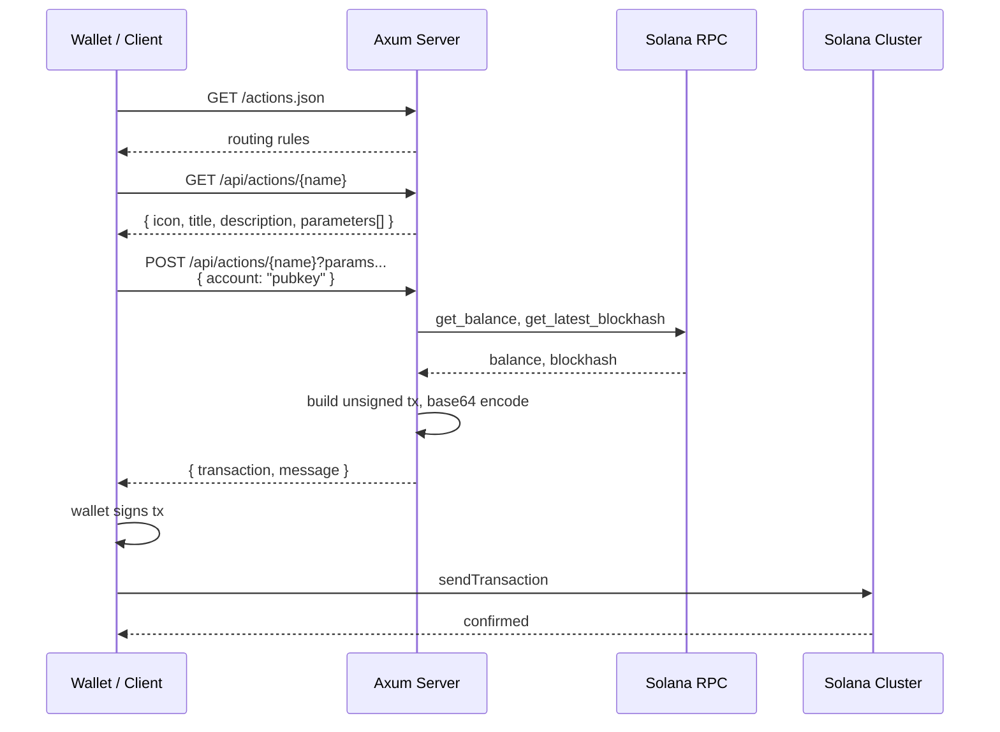

# Solana Blinks with Axum - A Learning Guide

Learn Rust and Axum by building Solana Actions (Blinks). This guide walks through every layer of the codebase, explaining Rust concepts, Axum patterns, and Solana integration as they appear.

## Table of Contents

- [What Are Solana Blinks?](#what-are-solana-blinks)
- [Prerequisites](#prerequisites)
- [Getting Started](#getting-started)
- [Architecture Overview](#architecture-overview)
- [Step 1: Entry Point and Async Runtime](#step-1-entry-point-and-async-runtime-mainrs)
- [Step 2: Router and Axum Fundamentals](#step-2-router-and-axum-fundamentals-routerrs)
- [Step 3: The Solana Actions Spec](#step-3-the-solana-actions-spec-specrs)
- [Step 4: Error Handling in Axum](#step-4-error-handling-in-axum-errorrs)
- [Step 5: CORS Middleware](#step-5-cors-middleware-corsrs)
- [Step 6: Traits and Dynamic Dispatch](#step-6-traits-and-dynamic-dispatch-actionsregistryrs)
- [Step 7: Building Solana Transactions](#step-7-building-solana-transactions-actionstransferrs)
- [Step 8: Action Chaining](#step-8-action-chaining-staterstransferrs)
- [Step 9: Writing Your Own Action](#step-9-writing-your-own-action)
- [Rust Concepts Reference](#rust-concepts-reference)
- [Axum Concepts Reference](#axum-concepts-reference)
- [API Reference](#api-reference)
- [Environment Variables](#environment-variables)

---

## What Are Solana Blinks?

Blinks (Blockchain Links) turn any URL into an interactive on-chain action. The flow:

1. A wallet/client sends a **GET** request to your server
2. Your server returns metadata (title, icon, form fields) that the wallet renders as a UI card
3. The user fills out the form and clicks a button
4. The wallet sends a **POST** with the user's public key and form parameters
5. Your server builds an **unsigned transaction** and returns it
6. The wallet signs the transaction and submits it to Solana

Your server never handles private keys. It only builds transactions.



---

## Prerequisites

- **Rust** (1.75+ recommended) - install via [rustup](https://rustup.rs/)
- Basic Rust knowledge: ownership, structs, enums, traits, `Result`
- A Solana RPC endpoint (the default public mainnet endpoint works for testing)

## Getting Started

```bash
# clone and enter the project
cd solana-blinks-axum

# copy environment config (defaults work out of the box)
cp .env.example .env

# run the server
cargo run
# => Listening on 0.0.0.0:3000
```

Test it:

```bash
# get action metadata
curl http://localhost:3000/api/actions/transfer | jq

# build a transaction (replace YOUR_PUBKEY with a real Solana address)
curl -X POST "http://localhost:3000/api/actions/transfer?to=DAw5ebjQBFruAFb7aehTTdbWixeTS3oS1BUAiZtKAvea&amount=0.01" \
  -H "Content-Type: application/json" \
  -d '{"account":"YOUR_PUBKEY"}'
```

---

## Architecture Overview

```
src/
├── main.rs            # entry point: env config, tokio runtime, graceful shutdown
├── router.rs          # Axum routes, shared state, request handlers
├── spec.rs            # Solana Actions protocol types (serde structs)
├── error.rs           # unified error type -> HTTP responses
├── cors.rs            # CORS middleware (required by the Blinks spec)
├── consts.rs          # constants: RPC URL, program IDs, treasury address
├── state.rs           # ChainState for multi-step action flows
└── actions/
    ├── mod.rs         # module declarations and re-exports
    ├── registry.rs    # Action trait, ActionRegistry, register_actions! macro
    ├── utils.rs       # helpers: parse params, serialize tx, build memo tx
    ├── transfer.rs    # "Send SOL" action
    ├── donate.rs      # "Donate SOL" + chained "Leave Memo" action
    └── swap.rs        # "Token Swap" placeholder
```

**Data flow:** `main.rs` boots the server -> `router.rs` routes requests -> handlers look up the action in `registry.rs` -> each action (e.g. `transfer.rs`) builds a Solana transaction -> the response goes back as JSON.

---

## Step 1: Entry Point and Async Runtime (`main.rs`)

```rust
#[tokio::main]
async fn main() {
    let _ = dotenvy::dotenv();
    // ...
}
```

### Rust Concepts Here

**`#[tokio::main]`** - This attribute macro transforms `async fn main()` into a regular `fn main()` that creates a Tokio runtime. Without it, Rust has no built-in way to run async code. Under the hood it becomes:

```rust
fn main() {
    tokio::runtime::Runtime::new().unwrap().block_on(async {
        // your async code here
    })
}
```

**Why Tokio?** Axum is built on Tokio. Every incoming HTTP request is handled as an async task on Tokio's thread pool. This means thousands of concurrent connections without one OS thread per connection.

**`let _ = dotenvy::dotenv()`** - The `let _ =` pattern intentionally discards the `Result`. We don't care if `.env` is missing (env vars might be set another way). Without `let _ =`, the compiler would warn about an unused `Result`.

### What Happens in Order

```rust
// 1. Load .env file (optional)
let _ = dotenvy::dotenv();

// 2. Initialize structured logging
tracing_subscriber::fmt()
    .with_env_filter(EnvFilter::from_default_env()
        .add_directive("info".parse().unwrap()))
    .init();

// 3. Read config from environment with fallback defaults
let rpc_url = std::env::var("RPC_URL").unwrap_or_else(|_| consts::DEFAULT_RPC_URL.into());
let host = std::env::var("HOST").unwrap_or_else(|_| consts::DEFAULT_HOST.into());
let port = std::env::var("PORT").unwrap_or_else(|_| consts::DEFAULT_PORT.into());

// 4. Create the Solana RPC client, wrapped in Arc for thread-safe sharing
let rpc = Arc::new(RpcClient::new(rpc_url));

// 5. Build the Axum router (all routes, middleware, state)
let app = router::build_router(rpc);

// 6. Bind to a TCP port and start serving
let listener = TcpListener::bind(&bind_addr).await.expect("Failed to bind");
axum::serve(listener, app)
    .with_graceful_shutdown(shutdown_signal())
    .await
    .expect("Server error");
```

### `Arc` - Shared Ownership Across Threads

```rust
let rpc = Arc::new(RpcClient::new(rpc_url));
```

`Arc<T>` (Atomic Reference Counted) lets multiple threads share ownership of the same value. When you clone an `Arc`, you're just incrementing a counter, not copying the `RpcClient`. When the last `Arc` is dropped, the inner value is freed.

**Why not just pass `RpcClient` directly?** Axum spawns each request handler as a separate async task. Multiple tasks need access to the same RPC client simultaneously. Rust's ownership model prevents multiple owners without `Arc`.

### Graceful Shutdown

```rust
async fn shutdown_signal() {
    let ctrl_c = async {
        signal::ctrl_c().await.expect("Failed to install Ctrl+C handler");
    };

    #[cfg(unix)]
    let terminate = async { /* listen for SIGTERM */ };

    tokio::select! {
        _ = ctrl_c => tracing::info!("Ctrl+C received"),
        _ = terminate => tracing::info!("SIGTERM received"),
    }
}
```

**`tokio::select!`** races multiple futures and completes when **any one** of them finishes. Here it waits for either Ctrl+C or SIGTERM, whichever comes first. The server then stops accepting new connections and finishes in-flight requests.

**`#[cfg(unix)]`** is a compile-time conditional. SIGTERM only exists on Unix systems. On Windows, this compiles to `std::future::pending::<()>()` (a future that never completes), so only Ctrl+C works.

---

## Step 2: Router and Axum Fundamentals (`router.rs`)

This file is the heart of the Axum setup. Every core Axum concept appears here.

### Shared Application State

```rust
pub struct AppState {
    pub rpc: Arc<RpcClient>,       // Solana RPC connection
    pub registry: ActionRegistry,  // all registered actions
    pub actions_json: ActionsJson, // pre-built actions.json response
}
```

Axum lets you attach state to the router that every handler can access. The state must be `Send + Sync` (safe to share across threads). `Arc<AppState>` satisfies this.

### Building the Router

```rust
pub fn build_router(rpc: Arc<RpcClient>) -> Router {
    let registry = register_actions![TransferAction, SwapAction, DonateAction, DonateMemoAction];
    let actions_json = registry.build_actions_json();
    let state = Arc::new(AppState { rpc, registry, actions_json });

    Router::new()
        .route("/actions.json", get(get_actions_json))
        .route("/api/actions/{*path}", get(handle_action_get).post(handle_action_post))
        .layer(actions_cors())
        .layer(TraceLayer::new_for_http()...)
        .with_state(state)
}
```

**Key Axum concepts:**

| Concept | Code | What It Does |
|---------|------|--------------|
| **Route** | `.route("/path", get(handler))` | Maps a URL pattern to handler functions |
| **Method routing** | `get(fn).post(fn)` | Different handlers for GET vs POST on the same path |
| **Wildcard path** | `{*path}` | Captures everything after `/api/actions/` as a `String` |
| **Middleware layers** | `.layer(cors).layer(trace)` | Wrap every request/response (applied bottom-up) |
| **Shared state** | `.with_state(state)` | Makes `AppState` available to all handlers |

**Layer ordering matters.** Layers wrap from bottom to top. In this code, `TraceLayer` (logging) runs first (outermost), then `CorsLayer` runs, then the handler. The response travels back out in reverse order.

### Axum Extractors - The Core Pattern

Extractors are how Axum converts raw HTTP requests into typed Rust values. Each handler parameter is an extractor:

```rust
async fn handle_action_post(
    Path(path): Path<String>,                      // from URL: /api/actions/{*path}
    State(state): State<Arc<AppState>>,             // shared application state
    Query(params): Query<HashMap<String, String>>,  // from query string: ?to=X&amount=Y
    Json(body): Json<ActionPostRequest>,            // from request body (deserialized)
) -> Result<Json<ActionPostResponse>, AppError> {
```

**How extractors work:**

1. Axum sees the handler's function signature
2. For each parameter, it calls the corresponding `FromRequest` / `FromRequestParts` implementation
3. If extraction fails (e.g. invalid JSON), Axum returns an error response automatically
4. If all extractions succeed, your handler runs with fully typed, validated data

**`Path(path): Path<String>`** - This uses Rust's **destructuring** syntax. `Path<String>` is the extractor type, and `Path(path)` destructures it to give you the inner `String` directly. Without destructuring you'd write:

```rust
async fn handler(path_extractor: Path<String>) {
    let path = path_extractor.0; // access inner value
}
```

**Extractor ordering rule:** `Json` (and any extractor that consumes the request body) must be **last**. The body can only be read once.

### The Return Type

```rust
-> Result<Json<ActionPostResponse>, AppError>
```

- **`Ok(Json(response))`** - Axum serializes `response` to JSON, sets `Content-Type: application/json`, returns HTTP 200
- **`Err(AppError::NotFound(...))`** - Axum calls `AppError::into_response()` (defined in `error.rs`) to produce the HTTP error

This works because both `Json<T>` and `AppError` implement Axum's `IntoResponse` trait.

### The Handler Logic

```rust
async fn handle_action_get(
    Path(path): Path<String>,
    State(state): State<Arc<AppState>>,
) -> Result<Json<ActionGetResponse>, AppError> {
    // 1. Look up the action by path in the registry
    let action = state.registry.get(&path)
        .ok_or_else(|| AppError::NotFound(format!("Action not found: {path}")))?;

    // 2. Call the action's metadata method and wrap in Json
    action.metadata(&state.rpc).await.map(Json)
}
```

**`ok_or_else(|| ...)?`** - Converts `Option<T>` to `Result<T, E>`. If the action isn't found, the `?` operator returns early with the error. This is idiomatic Rust error handling: no `if-else`, no unwrap, no panic.

**`.map(Json)`** - Wraps the `Ok` value in `Json` without touching the `Err`. Equivalent to `.map(|response| Json(response))`.

---

## Step 3: The Solana Actions Spec (`spec.rs`)

This file defines Rust structs that serialize/deserialize to match the [Solana Actions specification](https://solana.com/docs/advanced/actions). Every struct uses `serde` for JSON conversion.

### GET Response - The Action Card

```rust
#[derive(Debug, Clone, Serialize, Deserialize)]
pub struct ActionGetResponse {
    #[serde(rename = "type", skip_serializing, default = "default_action_type")]
    action_type: String,
    pub icon: String,
    pub title: String,
    pub description: String,
    pub label: String,
    #[serde(skip_serializing_if = "Option::is_none")]
    pub links: Option<ActionLinks>,
}
```

**Serde attributes explained:**

| Attribute | What It Does |
|-----------|--------------|
| `#[derive(Serialize, Deserialize)]` | Auto-generates JSON serialization code at compile time |
| `#[serde(rename = "type")]` | Serializes field `action_type` as `"type"` in JSON (`type` is a Rust keyword) |
| `#[serde(skip_serializing)]` | Reads `type` from JSON but never writes it back |
| `#[serde(default = "default_action_type")]` | If `type` is missing in input JSON, calls `default_action_type()` |
| `#[serde(skip_serializing_if = "Option::is_none")]` | Omits the field from JSON output if it's `None` |
| `#[serde(rename_all = "camelCase")]` | Converts Rust `snake_case` fields to `camelCase` in JSON |
| `#[serde(tag = "type", rename_all = "lowercase")]` | On enums: uses a `"type"` field as the discriminator |

### Builder Pattern

```rust
impl ActionGetResponse {
    pub fn new(icon: &str, title: &str, description: &str, label: &str) -> Self {
        Self { /* all fields */ }
    }

    pub fn with_links(mut self, actions: Vec<LinkedAction>) -> Self {
        self.links = Some(ActionLinks { actions });
        self  // returns self for chaining
    }
}
```

`with_links` takes `mut self` (ownership, not a reference) and returns `Self`. This enables method chaining:

```rust
ActionGetResponse::new("icon", "title", "desc", "label")
    .with_links(vec![...])
```

This is called the **builder pattern** in Rust.

### Linked Actions - Buttons and Forms

```rust
pub struct LinkedAction {
    pub href: String,                             // URL with {param} placeholders
    pub label: String,                            // button text
    pub parameters: Option<Vec<ActionParameter>>, // form fields
}
```

The `href` uses `{param}` placeholders that the client replaces with user input:

```rust
href: "/api/actions/transfer?to={to}&amount={amount}"
//                               ^^^^         ^^^^^^^^
//                       replaced by client from form fields
```

### POST Request and Response

```rust
// What the wallet sends
pub struct ActionPostRequest {
    pub account: String,  // the user's Solana public key
}

// What your server returns
pub struct ActionPostResponse {
    pub transaction: String,              // base64-encoded unsigned transaction
    pub message: Option<String>,          // optional confirmation text
    pub links: Option<NextActionLinks>,   // optional next step (chaining)
}
```

### Next Action (Chaining)

```rust
#[derive(Serialize, Deserialize)]
#[serde(tag = "type", rename_all = "lowercase")]
pub enum NextAction {
    Inline { action: ActionGetResponse },  // embed the next action directly
    Post { href: String },                 // URL to fetch the next action from
}
```

`#[serde(tag = "type")]` makes this a **tagged enum** in JSON:

```json
{ "type": "inline", "icon": "...", "title": "..." }
{ "type": "post", "href": "/api/actions/next-step" }
```

---

## Step 4: Error Handling in Axum (`error.rs`)

```rust
#[derive(Debug, thiserror::Error)]
pub enum AppError {
    #[error("Bad request: {0}")]
    BadRequest(String),

    #[error("Not found: {0}")]
    NotFound(String),

    #[error("RPC error: {0}")]
    Rpc(Box<solana_client::client_error::ClientError>),

    #[error("Serialization error: {0}")]
    Serialization(#[from] bincode::Error),
}
```

### Rust Concepts Here

**`thiserror`** - Derives `std::error::Error` and `Display` from the `#[error("...")]` attributes. Without it, you'd manually implement both traits.

**`#[from]`** - Auto-implements `From<bincode::Error> for AppError`, enabling the `?` operator to convert `bincode::Error` into `AppError::Serialization` automatically.

**`Box<ClientError>`** - `ClientError` is large. `Box` puts it on the heap so `AppError` stays small (important because `Result<T, AppError>` is returned everywhere and Rust passes it by value).

### Converting Errors to HTTP Responses

```rust
impl IntoResponse for AppError {
    fn into_response(self) -> Response {
        let status = match &self {
            AppError::BadRequest(_) => StatusCode::BAD_REQUEST,         // 400
            AppError::NotFound(_) => StatusCode::NOT_FOUND,             // 404
            AppError::Rpc(_) | AppError::Serialization(_) => StatusCode::INTERNAL_SERVER_ERROR, // 500
        };

        let body = ActionError { message: self.to_string() };
        (status, Json(body)).into_response()
    }
}
```

Axum requires your error type to implement `IntoResponse`. This single implementation handles every error in the app. The tuple `(StatusCode, Json<T>)` implements `IntoResponse` in Axum - it sets the status code and serializes the body.

**`match &self`** - Matches on a reference to avoid moving `self` before calling `.to_string()`.

---

## Step 5: CORS Middleware (`cors.rs`)

```rust
pub fn actions_cors() -> CorsLayer {
    CorsLayer::new()
        .allow_origin(HeaderValue::from_static("*"))
        .allow_methods([Method::GET, Method::POST, Method::PUT, Method::OPTIONS])
        .allow_headers([header::CONTENT_TYPE, header::AUTHORIZATION, ...])
}
```

**Why CORS?** Blinks are fetched by wallets and browser extensions from different domains. Without `Access-Control-Allow-Origin: *`, browsers block these cross-origin requests. The Solana Actions spec requires permissive CORS.

**How it works in Axum:** `CorsLayer` comes from the `tower-http` crate. When added via `.layer(actions_cors())`, it intercepts every response and adds the CORS headers. It also handles `OPTIONS` preflight requests automatically.

---

## Step 6: Traits and Dynamic Dispatch (`actions/registry.rs`)

### The Action Trait

```rust
#[async_trait]
pub trait Action: Send + Sync {
    fn path(&self) -> &'static str;

    async fn metadata(&self, rpc: &RpcClient) -> Result<ActionGetResponse, AppError>;

    async fn execute(
        &self,
        rpc: &RpcClient,
        account: Pubkey,
        params: HashMap<String, String>,
    ) -> Result<ActionPostResponse, AppError>;
}
```

**Traits** are Rust's version of interfaces. Every action (transfer, donate, swap) implements these three methods.

**`#[async_trait]`** - Rust traits don't natively support `async fn` in trait definitions (as of edition 2021). The `async_trait` macro rewrites them to return `Pin<Box<dyn Future>>` under the hood.

**`: Send + Sync`** - These are **marker traits** (supertraits) that guarantee the implementing type is safe to send between threads (`Send`) and share between threads (`Sync`). Required because Axum handlers run on a multi-threaded executor.

**`&'static str`** - A string slice that lives for the entire program. String literals like `"transfer"` are `&'static str` because they're embedded in the binary.

### The Registry - Trait Objects and Dynamic Dispatch

```rust
pub struct ActionRegistry {
    pub(crate) actions: HashMap<String, Box<dyn Action>>,
}
```

**`Box<dyn Action>`** - This is a **trait object**. It stores any type that implements `Action` on the heap, with a vtable pointer for method dispatch at runtime. This is **dynamic dispatch** (like virtual functions in C++).

**Why not generics?** The registry needs to store **different** types (TransferAction, DonateAction, SwapAction) in the same HashMap. Generics would require all values to be the same type. Trait objects let you mix types that share a trait.

**`pub(crate)`** - Visible within this crate but not to external code. More restrictive than `pub`, more permissive than private.

### The Registration Macro

```rust
#[macro_export]
macro_rules! register_actions {
    ($($action:expr),+ $(,)?) => {{
        let mut registry = ActionRegistry::new();
        $({
            let a = $action;
            registry.actions.insert(a.path().into(), Box::new(a));
        })+
        registry
    }};
}
```

**Declarative macros** (`macro_rules!`) generate code at compile time. This one:
- Takes one or more expressions (`$($action:expr),+`)
- Allows an optional trailing comma (`$(,)?`)
- For each action, calls `.path()` to get the key and `Box::new()` to create the trait object
- Returns the populated registry

Usage: `register_actions![TransferAction, SwapAction, DonateAction]`

### Auto-generating `actions.json`

```rust
pub fn build_actions_json(&self) -> ActionsJson {
    let mut paths = BTreeSet::new();  // sorted, deduplicated
    for key in self.actions.keys() {
        if let Some((parent, _)) = key.rsplit_once('/') {
            paths.insert(format!("/api/actions/{parent}/*"));
        } else {
            paths.insert(format!("/api/actions/{key}"));
        }
    }
    // ... convert to ActionRule structs
}
```

This builds the `/actions.json` manifest from registered action paths. `BTreeSet` ensures sorted, unique entries. Actions with nested paths (like `donate/memo`) get a wildcard rule (`/api/actions/donate/*`).

---

## Step 7: Building Solana Transactions (`actions/transfer.rs`)

The transfer action is the clearest example of building a Solana transaction from scratch.

### GET - Defining the UI

```rust
async fn metadata(&self, _rpc: &RpcClient) -> Result<ActionGetResponse, AppError> {
    Ok(ActionGetResponse::new(
        SOLANA_LOGO_URL,                               // icon
        "Send SOL",                                    // title
        "Transfer SOL to a specified address",         // description
        "Send",                                        // button label
    )
    .with_links(vec![LinkedAction {
        href: "/api/actions/transfer?to={to}&amount={amount}".into(),
        label: "Send SOL".into(),
        parameters: Some(vec![
            ActionParameter::text("to", "Recipient address", true),
            ActionParameter::number("amount", "Amount (SOL)", true).with_min(0.001),
        ]),
    }]))
}
```

This returns JSON that the wallet renders as a card with two input fields and a "Send SOL" button.

### POST - Building the Transaction

```rust
async fn execute(&self, rpc: &RpcClient, account: Pubkey, params: HashMap<String, String>)
    -> Result<ActionPostResponse, AppError>
{
    // 1. Parse query parameters into typed values
    let recipient: Pubkey = get_param(&params, "to")?;
    let amount_sol: f64 = get_param(&params, "amount")?;
```

**`get_param::<T>`** (in `utils.rs`) extracts a value from the HashMap and parses it using Rust's `FromStr` trait. `Pubkey` implements `FromStr`, so the string is validated as a valid Solana address automatically.

```rust
    // 2. Fire concurrent RPC calls
    let (balance_res, account_res, blockhash_res) = tokio::join!(
        rpc.get_balance(&account),
        rpc.get_account(&recipient),
        rpc.get_latest_blockhash(),
    );
```

**`tokio::join!`** runs multiple futures **concurrently** (not sequentially). All three RPC calls fire at once and we wait for all of them. This is much faster than three sequential `.await` calls. Compare:

```rust
// Sequential: ~300ms (100ms + 100ms + 100ms)
let balance = rpc.get_balance(&account).await?;
let account = rpc.get_account(&recipient).await?;
let blockhash = rpc.get_latest_blockhash().await?;

// Concurrent: ~100ms (all at once)
let (balance, account, blockhash) = tokio::join!(
    rpc.get_balance(&account),
    rpc.get_account(&recipient),
    rpc.get_latest_blockhash(),
);
```

```rust
    // 3. Validate balance
    let balance = balance_res?;
    if balance < lamports + LAMPORTS_PER_SIGNATURE {
        return Err(AppError::BadRequest(format!(
            "Insufficient balance: you have {} SOL but need {} SOL + fees",
            lamports_to_sol(balance), amount_sol,
        )));
    }
```

**Early return pattern** - If validation fails, return an error immediately. No deeply nested `if-else`. The `?` operator on `balance_res?` unwraps the `Result` or returns the error to the caller.

```rust
    // 4. Check if recipient account exists (rent exemption check)
    let recipient_exists = match account_res {
        Ok(_) => true,
        Err(err) if err.to_string().contains("AccountNotFound") => false,
        Err(err) => return Err(err.into()),
    };
```

**`match` with guards** - `Err(err) if condition` is a match guard. It matches only `Err` variants where the condition is true. This distinguishes "account doesn't exist" (expected) from actual RPC errors (unexpected).

```rust
    // 5. Build the unsigned transaction
    let ix = system_instruction::transfer(&account, &recipient, lamports);
    let blockhash = blockhash_res?;
    let msg = Message::new_with_blockhash(&[ix], Some(&account), &blockhash);
    let transaction = serialize_tx(&Transaction::new_unsigned(msg))?;
```

**Solana transaction anatomy:**
- **Instruction (`ix`)** - What to do: transfer `lamports` from `account` to `recipient`
- **Message** - Wraps instructions with a recent blockhash (prevents replay) and the fee payer
- **Transaction** - Built **unsigned** - the wallet signs it client-side
- **`serialize_tx`** - `bincode::serialize` -> `base64::encode` -> the string the wallet expects

```rust
    Ok(ActionPostResponse {
        transaction,
        message: Some(format!("Sending {amount_sol} SOL to {recipient}")),
        links: None,
    })
```

### Utility Functions (`actions/utils.rs`)

```rust
// Extract and parse a query parameter, or return 400
pub fn get_param<T: FromStr>(params: &HashMap<String, String>, key: &str) -> Result<T, AppError>

// Convert between SOL (f64) and lamports (u64) - 1 SOL = 1_000_000_000 lamports
pub fn sol_to_lamports(sol: f64) -> u64
pub fn lamports_to_sol(lamports: u64) -> f64

// Serialize a Transaction to base64 string
pub fn serialize_tx(tx: &Transaction) -> Result<String, AppError>

// Build a complete Memo program transaction
pub async fn build_memo_tx(rpc: &RpcClient, payer: &Pubkey, memo: &str) -> Result<String, AppError>
```

**`get_param<T: FromStr>`** uses a **generic type bound**. `T` can be any type that implements `FromStr` (`Pubkey`, `f64`, `String`, etc.). The compiler generates a specialized version for each `T` you use.

---

## Step 8: Action Chaining (`state.rs` + `donate.rs`)

Action chaining lets you build multi-step flows. The donate action demonstrates this with two steps: transfer SOL, then leave a memo.

### ChainState - Stateless State Passing

```rust
pub struct ChainState {
    data: HashMap<String, String>,
}
```

The server stores **nothing** between steps. Instead, state is encoded as URL-safe base64 JSON and passed via a `_chain` query parameter:

```rust
// Step 1: Stash data for next step
let mut state = ChainState::new();
state.set("amount", &amount.to_string());
let next_href = state.encode_into("/api/actions/donate/memo");
// Result: "/api/actions/donate/memo?_chain=eyJhbW91bnQiOiIwLjUifQ"
```

```rust
// Step 2: Read it back
let state = ChainState::decode_from(&params)?;
let amount = state.get("amount")?;
```

### The Donate Flow

**Step 1: `DonateAction`** (path: `"donate"`)
1. User picks a donation amount
2. Server builds a SOL transfer to the treasury
3. Returns the transaction AND an inline next action (the memo form)

```rust
Ok(ActionPostResponse {
    transaction,
    message: Some(format!("Donated {amount} SOL")),
    links: Some(NextActionLinks {
        next: NextAction::Inline {
            action: ActionGetResponse::new(/* memo form */)
                .with_links(vec![LinkedAction {
                    href: format!("{next_href}&memo={{memo}}"),
                    // ...
                }]),
        },
    }),
})
```

**Step 2: `DonateMemoAction`** (path: `"donate/memo"`)
1. Decodes the chain state to get the donation amount from step 1
2. Reads the user's memo text from query params
3. Builds a Memo program transaction with `"donation:0.5SOL:Thanks!"`

```rust
let state = ChainState::decode_from(&params)?;
let amount = state.get("amount")?;
let memo_text: String = get_param(&params, "memo")?;
let transaction = build_memo_tx(rpc, &account, &format!("donation:{amount}SOL:{memo_text}")).await?;
```

The wallet handles the flow: after the first transaction confirms, it reads `links.next` and shows the memo form automatically.

---

## Step 9: Writing Your Own Action

### 1. Create the action file

```rust
// src/actions/my_action.rs
use async_trait::async_trait;
use solana_client::nonblocking::rpc_client::RpcClient;
use solana_sdk::pubkey::Pubkey;
use std::collections::HashMap;

use crate::actions::{get_param, serialize_tx, Action};
use crate::error::AppError;
use crate::spec::*;

pub struct MyAction;

#[async_trait]
impl Action for MyAction {
    fn path(&self) -> &'static str {
        "my-action"
    }

    async fn metadata(&self, _rpc: &RpcClient) -> Result<ActionGetResponse, AppError> {
        Ok(ActionGetResponse::new(
            "https://example.com/icon.png",
            "My Action",
            "Does something cool on Solana",
            "Do It",
        )
        .with_links(vec![LinkedAction {
            href: "/api/actions/my-action?param={param}".into(),
            label: "Do It".into(),
            parameters: Some(vec![
                ActionParameter::text("param", "Enter a value", true),
            ]),
        }]))
    }

    async fn execute(
        &self,
        rpc: &RpcClient,
        account: Pubkey,
        params: HashMap<String, String>,
    ) -> Result<ActionPostResponse, AppError> {
        let param: String = get_param(&params, "param")?;

        // Build your Solana instruction here
        let ix = /* your instruction */;
        let blockhash = rpc.get_latest_blockhash().await?;
        let msg = solana_sdk::message::Message::new_with_blockhash(
            &[ix], Some(&account), &blockhash,
        );
        let transaction = serialize_tx(
            &solana_sdk::transaction::Transaction::new_unsigned(msg),
        )?;

        Ok(ActionPostResponse {
            transaction,
            message: Some(format!("Did the thing with {param}")),
            links: None,
        })
    }
}
```

### 2. Register the module

In `src/actions/mod.rs`:

```rust
pub mod my_action;  // add this line
```

### 3. Register the action

In `src/router.rs`:

```rust
use crate::actions::my_action::MyAction;

let registry = register_actions![
    TransferAction,
    SwapAction,
    DonateAction,
    DonateMemoAction,
    MyAction,  // add it here
];
```

That's it. The macro auto-generates routing rules. `GET /api/actions/my-action` returns your form, `POST` builds the transaction.

---

## Rust Concepts Reference

Quick reference for Rust concepts used throughout the codebase:

| Concept | Example in Code | What It Means |
|---------|----------------|---------------|
| **`Arc<T>`** | `Arc::new(RpcClient::new(...))` | Thread-safe shared ownership via reference counting |
| **`Box<dyn Trait>`** | `Box<dyn Action>` | Heap-allocated trait object, enables dynamic dispatch |
| **`async/await`** | `rpc.get_balance(&account).await?` | Non-blocking I/O, yields control while waiting |
| **`?` operator** | `balance_res?` | Unwrap `Result` or return error early |
| **`#[derive(...)]`** | `#[derive(Serialize, Clone)]` | Auto-implement traits at compile time |
| **`impl Trait for Type`** | `impl Action for TransferAction` | Implement an interface for a specific type |
| **`match` with guards** | `Err(e) if e.to_string().contains(...)` | Pattern matching with additional conditions |
| **`tokio::join!`** | `tokio::join!(fut1, fut2, fut3)` | Run futures concurrently, wait for all |
| **`tokio::select!`** | `tokio::select! { _ = a => ..., _ = b => ... }` | Race futures, take first to complete |
| **Closures** | `\|_\| consts::DEFAULT_HOST.into()` | Anonymous functions, often used with `map`, `ok_or_else` |
| **`From`/`Into`** | `#[from] bincode::Error` | Type conversion, enables `?` across error types |
| **`LazyLock`** | `static MEMO_PROGRAM_ID: LazyLock<Pubkey>` | Lazily initialized global constant |
| **`macro_rules!`** | `register_actions![...]` | Compile-time code generation |

## Axum Concepts Reference

| Concept | Example | Purpose |
|---------|---------|---------|
| **`Router`** | `Router::new().route(...)` | Define URL -> handler mappings |
| **`get(fn).post(fn)`** | `.route(path, get(h1).post(h2))` | Method-specific handlers on same path |
| **`{*path}`** | `/api/actions/{*path}` | Wildcard URL capture |
| **`State(s)`** | `State(state): State<Arc<AppState>>` | Extract shared application state |
| **`Path(p)`** | `Path(path): Path<String>` | Extract URL path parameters |
| **`Query(q)`** | `Query(params): Query<HashMap<...>>` | Extract query string key-value pairs |
| **`Json(b)`** | `Json(body): Json<ActionPostRequest>` | Deserialize JSON request body |
| **`Json(r)` return** | `Ok(Json(response))` | Serialize response as JSON |
| **`IntoResponse`** | `impl IntoResponse for AppError` | Convert custom types to HTTP responses |
| **`.layer()`** | `.layer(CorsLayer::new())` | Add middleware (CORS, logging, auth) |
| **`.with_state()`** | `.with_state(Arc::new(state))` | Attach shared state to router |

---

## API Reference

| Method | Path | Description |
|--------|------|-------------|
| GET | `/actions.json` | Action manifest (routing rules for clients) |
| GET | `/api/actions/transfer` | Transfer form metadata |
| POST | `/api/actions/transfer?to=X&amount=Y` | Build SOL transfer transaction |
| GET | `/api/actions/donate` | Donate form metadata |
| POST | `/api/actions/donate?amount=Y` | Build treasury transfer + inline memo form |
| POST | `/api/actions/donate/memo?_chain=X&memo=Y` | Build memo transaction (chained from donate) |
| GET | `/api/actions/swap` | Swap form metadata |
| POST | `/api/actions/swap?from_token=X&amount=Y` | Build swap transaction (placeholder) |

## Environment Variables

| Variable | Default | Description |
|----------|---------|-------------|
| `RPC_URL` | `https://api.mainnet-beta.solana.com` | Solana RPC endpoint |
| `HOST` | `0.0.0.0` | Server bind address |
| `PORT` | `3000` | Server listen port |
| `RUST_LOG` | - | Log filter (e.g. `info`, `solana_blinks_axum=debug`) |
